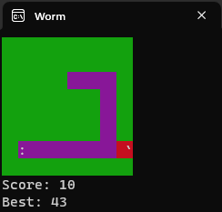

# python-term-worm

This python program lets you play worm (clone of snake) in a terminal!

A PyGame window tracks events and the highscore is kept in a JSON file.

### Installation

Run

```
pip install pygame
pip install bext
```

Copy the code from worm.py, paste to your editor, and save.

### Use

Just run the file!

Keys:
- q to quit
- WASD or arrow keys to move

### Bugs

If you are two blocks long and are (lets say) going up, if you turned left and quickly turned down you can change your direction 180 degrees.
(If you were not 2 blocks long you would run into your tail and lose.)


